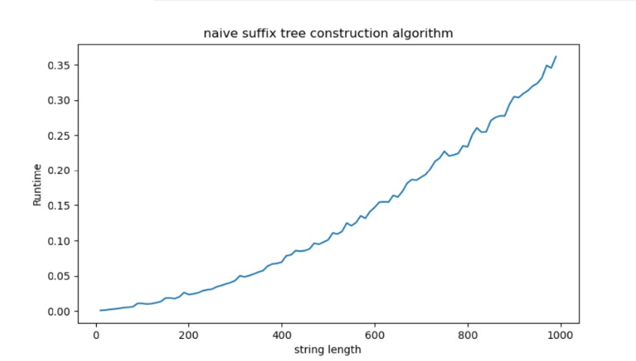
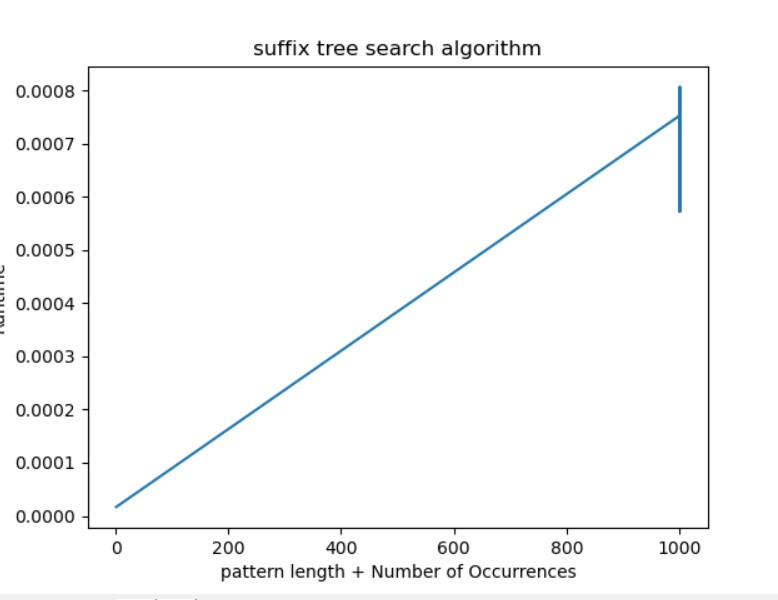

# Project 2: Suffix tree construction

You should implement a suffix tree construction algorithm. You can choose to implement the naive O(n²)-time construction algorithm as discussed in class or McCreight’s O(n) construction algorithm. After that, implement a search algorithm (similar to slow-scan) for finding all occurrences of a pattern. This algorithm should run in O(m+z) where m is the length of the pattern and z the number of occurrences.

Write a program, `st` using the suffix tree exact pattern search algorithm (similar to slow-scan) to report all indices in a string where a given pattern occurs. 

The program should take the same options as in project 1: `st genome.fa reads.fq`. The program should output (almost) the same SAM file. Because a search in a suffix tree is not done from the start to the end of the string the output might be in a different order, but if you sort the output from the previous project and for this program, they should be identical.

## Evaluation

Implement the tool `st` that does exact pattern matching using a suffix tree. Test it to the best of your abilities, and then fill out the report below.

# Report

## Specify if you have used a linear time or quadratic time algorithm.

The algorithm used for the tree construction is the quadratic time (naïve) algorithm, where each suffix is being introduced indepently from the other, going down the previous nodes (if possible) and building the nodes iteratively.

## Insights you may have had while implementing and comparing the algorithms.

The implementation of the tree construction algorithm has been pretty straight-forward, but the difference in performance with McCreight's algorithm is very noticeable.

## Problems encountered if any.

In the case of the tree construction algorithm we have had some problems with the pointer adjustment when inserting new nodes on the suffix tree, since you have to be especially careful when doing it.

## Correctness

*Describe experiments that verifies the correctness of your implementations.*

## Running time

### Naive Construction Algorithm
The worst case inputs would be strings which suffixes are prefixes of any bigger suffix (the very worst case is a string of only the same character e.g. "aaaaaaaaa"), as this means the algorithm will need to search and compare each individual character of each suffix and when it creates a new node it will already have compared all characters of the suffix. This means the worst case is O(n^2) because it has to compare each character in each suffix to another character (except for the suffix that is the whole string).

The best case input would be a string with no repeating characters, as this would mean it only has to compare the first character of the suffix to the first character of each child of the root before inserting the suffix in a new child of the root. This means it is O(a*n) for best case, where a is the size of the alphabet and n is the size of the string.

To prove our implementation takes at most O(n^2) we benchmarked the runtime of the construction of suffix trees of strings of varying length consisting of only the same character as this is the worst case input. 

Looking at the figure, the quadratic shape is apparent.

### Search algorithm
The worst case input for search is the largest possible search pattern with most possible number of occurrences, e.g. a string of only one character and a pattern of only the same character. This is because the search will compare each character in the pattern against another single character in the suffix tree O(m), and then will have to traverse the tree to report each occurrence (z). As a result it is O(m+z) in the worst case.

The best case would be the shortest possible pattern with no occurrences, e.g. a pattern which only one character that does not appear in the suffix tree.

To prove our implementation takes at most O(m+z) we benchmarked the runtime of the search with patterns of varying length and strings of varying length(so to also increase number of occurrences) both consisting of only the same character as this is the worst case input. 

Looking at the figure, the linear shape is apparent.

